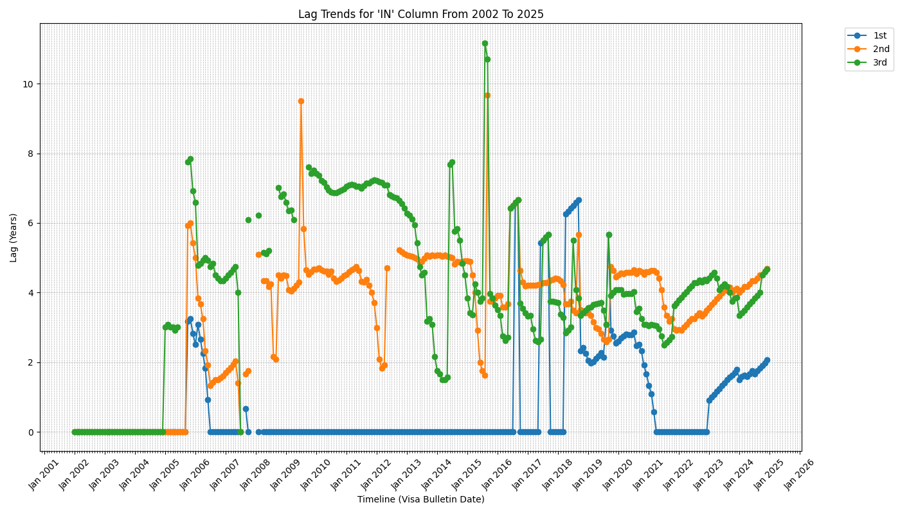

# us-visa-analysis

Some scripts to help me analyse (publicly available) US visa data.

## 1. visa-bulletin-scraper.py
I'd like to write some scripts to help visualise Employment-based visa status for the US over the years, for different country categories (India, China, Mexico, RoW). This is purely for my own information.  

This script plots the lag period (the time between the visa bulletin date and the date specified in the visa bulletin for different countries/employment-based visa categories), if any. If the table shows 'C', that means that the visa category is 'Current' for that country category, i.e. once the Visa/PERM is approved, the applicant can immediately apply for a Green Card/ there is one already available for the applicant. If the date is not yet 'Current' but is some time in the past, the applicant must wait once the PERM is approved for that date to become equal to the applicant's Priority Date. Once that condition is met, the applicant can proceed in the Green Card process. 

To run: 
```
$ python3 visa-bulletin-scraper.py --help

usage: US Visa bulletin data scraper and data visualisation [-h] [-c COUNTRY_CATEGORY]

This program will take arguments relating to country category and display thelag time for
being eligible to apply for a green card for the first three employment categoriesfor that
country category.

options:
  -h, --help            show this help message and exit
  -c COUNTRY_CATEGORY, --country-category COUNTRY_CATEGORY
                        Country category.
                        IN(India)/CH(China)/ME(Mexico)/PH(Phillipines)/V(Vietnam)/All. IN
                        default.
  -s START_YEAR, --start-year START_YEAR
                        Year to start analysis. Should be >= 2001.
  -e END_YEAR, --end-year END_YEAR
                        Year to end analysis. Should be <= current year.
```

The final artifact of this script is an image created in the images directory for the country category you provided.

## Example plot: 

Input command: 
```
python3 visa-bulletin-scraper.py -c IN -s 2002 -e 2025
```

Output diagram: 
